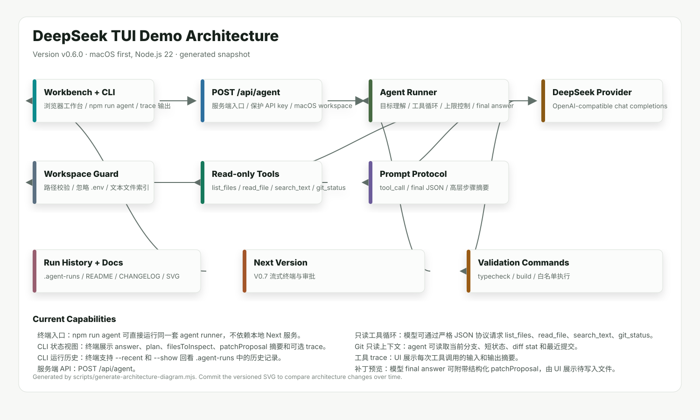

# DeepSeek TUI Demo

一个用 Next.js、TypeScript 和 DeepSeek 学习 agent 编码工具的最小实现。

> Environment: macOS first, Node.js 22

## Purpose

- 参考 opencode、DeepSeek-TUI、openclaude 的方向，先做一个容易理解的 agent 编码工作台。
- 把 agent 拆成 UI、API、模型 provider、工作区工具、运行 trace、文档生成几个小模块。
- 优先学习 agent 的控制流，而不是一开始追求完整 IDE 或复杂 TUI。

## Quick Start

```bash
npm install
cp .env.example .env.local
npm run dev
```

Open http://localhost:3000 and run a goal from the workbench.

## Architecture



- **Next.js App**: 负责输入任务、展示 agent trace、展示结构化建议。
- **CLI Shell**: 通过 npm run agent 直接复用 agent runner，提供终端入口、trace 输出和运行历史回看。
- **API Route**: 运行在 Node.js 服务端，读取环境变量和本地仓库。
- **Agent Runner**: 组织任务理解、仓库扫描、LLM 调用、结果解析。
- **DeepSeek Provider**: 封装 OpenAI-compatible chat completions 请求，默认使用 DeepSeek。
- **Workspace Tools**: 当前支持安全只读扫描、文件读取、文本搜索和 Git 状态读取，后续扩展 write_patch、run_command。
- **README Generator**: 从项目规划数据和 package scripts 生成 README，并由 pre-commit hook 自动执行。

Architecture snapshots are stored in `docs/architecture/` for version-to-version comparison.

## Current Features

- Next.js 16 + React 19 + TypeScript 6 项目骨架。
- 浏览器工作台：输入目标、运行 agent、查看步骤摘要和建议。
- 终端入口：npm run agent 可直接运行同一套 agent runner，不依赖本地 Next 服务。
- CLI 状态视图：终端展示 answer、plan、filesToInspect、patchProposal 摘要和可选 trace。
- CLI 运行历史：终端支持 --recent 和 --show 回看 .agent-runs 中的历史记录。
- 服务端 API：POST /api/agent。
- DeepSeek provider：读取 DEEPSEEK_API_KEY、DEEPSEEK_BASE_URL、DEEPSEEK_MODEL。
- 离线模式：没有 API key 时仍能返回本地规划结果。
- 工作区索引：忽略 .git、node_modules、.next 和真实 .env 文件，只暴露文本文件路径。
- 只读工具循环：模型可通过严格 JSON 协议请求 list_files、read_file、search_text、git_status。
- Git 只读上下文：agent 可读取当前分支、短状态、diff stat 和最近提交。
- 工具 trace：UI 展示每次工具调用的输入和输出摘要。
- 补丁预览：模型 final answer 可附带结构化 patchProposal，由 UI 展示待写入文件。
- 人工审批：用户点击应用补丁后，服务端重新校验路径和 action，再写入 create/replace 文件。
- 验证命令：UI 可触发 npm run typecheck 和 npm run build，服务端只执行白名单命令。
- DeepSeek 实战参数：默认启用 response_format=json_object，显式控制 thinking，并配置 max_tokens。
- 运行记录：每次 agent run 会保存到本地 .agent-runs，并可在 UI 中回看最近运行。
- 验证关联：验证命令可关联当前 runId，结果会追加到本地运行记录。
- Node.js 22 环境声明：仓库包含 .nvmrc 和 package.json engines。
- 服务端调试入口：VS Code 可附着到 Next.js 16 inspector，并通过浏览器请求命中受控 debug probe。
- 调试自检脚本：npm run debug:check 可验证 /api/agent 请求是否真的触发服务端暂停。
- 版本架构图：每次版本更新生成 docs/architecture/architecture-vX.Y.Z.svg 和 latest SVG 快照。
- 自动文档生成：pre-commit 时运行 npm run docs:generate 并自动 git add README.md docs/architecture。
- 独立开发上下文：docs/DEVELOPMENT_CONTEXT.md 记录参考项目、实现取舍和下一版 prompt。
- 独立变更日志：CHANGELOG.md 记录每个版本新增内容和限制。

## DeepSeek

- Base URL: `https://api.deepseek.com`
- Default model: `deepseek-v4-flash`

- DeepSeek API 使用 OpenAI-compatible chat completions 格式。
- deepseek-chat 和 deepseek-reasoner 在官方文档中标注将于 2026-07-24 弃用；本项目默认使用 deepseek-v4-flash，并允许通过 DEEPSEEK_MODEL 覆盖。
- 可通过 DEEPSEEK_THINKING=enabled 为支持的模型开启 thinking 参数；UI 只展示高层步骤摘要。

Sources:
- https://api-docs.deepseek.com/
- https://api-docs.deepseek.com/zh-cn/

## Implementation Thinking

- 先做 Web 版而不是 TUI，是因为用户希望用 TS 和 Next 学习，浏览器 UI 更利于快速观察 agent 状态。
- V0 只读仓库，先把 agent loop 跑通；写文件和跑命令会放到人工确认之后。
- LLM 输出要求结构化 JSON，这样 UI 和后续自动化都更稳定。
- 保留的是高层实现步骤与取舍，不记录逐字隐藏推理。
- DeepSeek 逻辑独立成 provider，后续可以平滑加入 OpenAI、Claude、本地模型或 OpenRouter。
- V0.2 已从 one-shot 仓库快照升级到显式 read-only tool loop，下一步进入补丁预览和人工审批。
- 工具循环采用 provider-agnostic 的 JSON 协议，方便后续接入原生 function calling 或 CLI/TUI。
- 版本架构图使用无依赖 SVG 生成，作为每次版本更新时的视觉快照。
- V0.3 把写文件拆成 patchProposal、UI 预览、用户确认、服务端安全应用四步，贴近真实 coding agent 的审批边界。
- V0.4 加入白名单验证命令，并按 DeepSeek 官方 JSON Output 和 thinking 参数规则收紧请求。
- V0.5 引入本地 run history，让每次 agent 运行、补丁元信息和验证结果形成可回看的任务轨迹。
- 服务端调试先用受控 debugger 语句验证 VS Code 是否附着到真实请求进程，再排查 sourcemap 和普通断点。
- V0.5 后续维护把运行环境升级到 Node.js 22、Next.js 16 和 React 19，调试入口改用官方 next dev --inspect。
- V0.6 让终端入口直接复用 agent runner，而不是绕 HTTP 调用本地页面服务，后续再演进为真正 TUI。
- V0.6 的 Git 工具保持只读和固定命令列表，先让模型理解工作区状态，暂不允许模型执行任意 shell。

## Development Context

- `docs/DEVELOPMENT_CONTEXT.md`: 下一版本开发时优先阅读的上下文、参考项目摘要和 prompt。
- `CHANGELOG.md`: 按版本记录功能、限制和重要取舍。
- `docs/architecture/`: 按版本保存架构图 SVG，方便横向对比系统演进。
- `docs/DEBUGGING.md`: 服务端调试步骤，记录如何让浏览器请求触发 Next API 断点。
- `docs/CLI.md`: 终端入口使用说明，记录 V0.6 CLI 的命令、能力和限制。

## Roadmap

### V0.1 · 只读 agent 工作台

- 任务输入
- 仓库扫描
- DeepSeek 调用
- 结构化建议
- README 自动生成

### V0.2 · 工具调用雏形

- list_files/read_file/search_text 显式工具协议
- 模型多轮选择只读工具
- 工具调用次数上限
- 工具输入和输出摘要 trace

### V0.3 · 补丁预览

- 结构化 patchProposal
- UI 补丁预览
- 人工确认后安全写入
- 路径和 action 校验

### V0.4 · 命令执行与验证

- npm 脚本白名单
- npm run typecheck/build
- UI 验证输出
- DeepSeek JSON Output 配置

### V0.5 · 运行历史

- 本地 run store
- 最近运行列表
- 运行结果回看
- 验证结果关联

### V0.6 · 终端/TUI 外壳

- CLI 命令入口
- 终端状态视图
- 运行历史回看
- Git 只读工具

### V0.7 · 流式终端与审批

- CLI 流式 trace
- 终端补丁审批
- 验证命令串联
- 更完整的会话恢复

## Scripts

- `dev`: `next dev`
- `dev:inspect`: `next dev --inspect=127.0.0.1:9229 -H 127.0.0.1 --webpack`
- `dev:inspect:break`: `DEBUG_AGENT_ROUTE_BREAK=1 DEBUG_DEEPSEEK_BREAK=1 next dev --inspect=127.0.0.1:9229 -H 127.0.0.1 --webpack`
- `debug:check`: `node scripts/debug/check-agent-breakpoint.mjs`
- `agent`: `node --import tsx src/cli/agent.ts`
- `build`: `next build`
- `start`: `next start`
- `typecheck`: `tsc --noEmit`
- `architecture:generate`: `node scripts/generate-architecture-diagram.mjs`
- `docs:generate`: `npm run architecture:generate && npm run readme:generate`
- `readme:generate`: `node scripts/generate-readme.mjs`
- `hooks:install`: `node scripts/install-git-hooks.mjs`
- `prepare`: `node scripts/install-git-hooks.mjs`

## README Automation

This README is generated from `docs/project-plan.json` and `package.json`.

The repository uses `.githooks/pre-commit` to run:

```bash
npm run docs:generate
git add README.md docs/architecture
```

If hooks are not active after cloning, run:

```bash
npm run hooks:install
```
